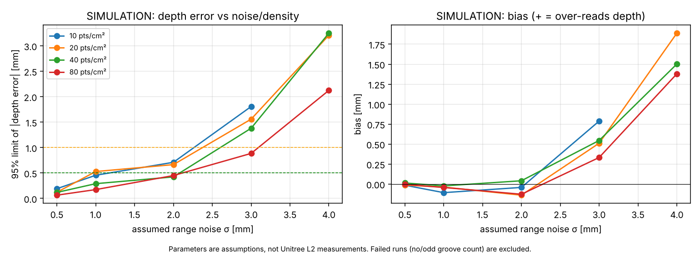

# Simulation sensitivity study (NOT Unitree L2 data)

**Read this first.** These numbers come from the synthetic tire generator (`treadlidar.simulation`) with *assumed* range noise σ and surface
point density. They describe what the **algorithms** can do if a sensor delivered that quality, and what quality would be *needed* for ±0.5-1.0 mm.
They say **nothing** about what the Unitree L2 actually delivers - that must be measured (`docs/SCANNING_PROCEDURE.md`).

Setup: passenger-size tread patch (R = 300 mm, 4 longitudinal grooves 10-12 mm wide × 8.0 mm deep, shoulder lateral grooves 6 mm × 7 mm, 4 mm crown,
sensor 0.6 m away, frontal view), Gaussian range noise along each ray, ray-cast self-occlusion, 4 random seeds per row, ground truth depth 8.0 mm.
Reproduce: `treadlidar sweep --out docs/results --noise-mm 0.5 1 2 3 4 --density 10 20 40 80 --seeds 4`.

Error = measured − true groove depth over all grooves and seeds. "runs failed" = analysis error or wrong groove count (those runs are excluded - so rows with failures flatter the statistics).

| σ (mm) | pts/cm² | runs ok/failed | bias (mm) | SD (mm) | 95% limit of \|error\| (mm) | within ±0.5 | within ±1.0 |
|---|---|---|---|---|---|---|---|
| 0.5 | 10 | 4/0 | -0.01 | 0.09 | 0.19 | 100% | 100% |
| 0.5 | 20 | 4/0 | -0.01 | 0.05 | 0.12 | 100% | 100% |
| 0.5 | 40 | 4/0 | +0.01 | 0.05 | 0.12 | 100% | 100% |
| 0.5 | 80 | 4/0 | -0.00 | 0.03 | 0.06 | 100% | 100% |
| 1.0 | 10 | 4/0 | -0.11 | 0.18 | 0.46 | 100% | 100% |
| 1.0 | 20 | 4/0 | -0.04 | 0.25 | 0.53 | 88% | 100% |
| 1.0 | 40 | 4/0 | -0.02 | 0.14 | 0.29 | 100% | 100% |
| 1.0 | 80 | 4/0 | -0.04 | 0.07 | 0.17 | 100% | 100% |
| 2.0 | 10 | 4/0 | -0.04 | 0.34 | 0.71 | 94% | 100% |
| 2.0 | 20 | 4/0 | -0.14 | 0.27 | 0.66 | 81% | 100% |
| 2.0 | 40 | 4/0 | +0.04 | 0.19 | 0.42 | 100% | 100% |
| 2.0 | 80 | 4/0 | -0.13 | 0.16 | 0.45 | 100% | 100% |
| 3.0 | 10 | 1/3 | +0.79 | 0.52 | 1.81 | 50% | 50% |
| 3.0 | 20 | 3/1 | +0.51 | 0.53 | 1.56 | 42% | 92% |
| 3.0 | 40 | 4/0 | +0.55 | 0.43 | 1.38 | 56% | 94% |
| 3.0 | 80 | 4/0 | +0.33 | 0.28 | 0.88 | 75% | 100% |
| 4.0 | 10 | 0/4 | - | - | - | - | - |
| 4.0 | 20 | 3/1 | +1.89 | 0.67 | 3.21 | 0% | 8% |
| 4.0 | 40 | 4/0 | +1.50 | 0.89 | 3.25 | 6% | 25% |
| 4.0 | 80 | 4/0 | +1.38 | 0.38 | 2.12 | 0% | 12% |

## What this tells us (simulation only)
* With σ ≤ 1 mm the pipeline recovers 8 mm depth with a 95 % error limit of about 0.1-0.5 mm; at σ = 2 mm, about 0.4-0.7 mm. So ±1.0 mm needs roughly **σ ≲ 2-3 mm
  with ≥ 20-40 effective points/cm² accumulated on the tread**, and ±0.5 mm needs about **σ ≲ 1-2 mm with ≥ 40 pts/cm²** - *if* the real sensor has no
  systematic bias and the surface behaves like the model.
* Beyond σ ≈ 3 mm the method degrades quickly: depth is over-read (positive bias; I have not isolated the cause - plausibly noise inflating apparent groove contrast after thresholding, unverified) and runs start to fail.
* Averaging more points helps (compare 10 → 80 pts/cm²) but only for random noise; the real L2 will add systematic effects the simulation does not have.

## Decisive unknowns for the real L2 (to be measured)
range noise on black rubber at 0.4-1.0 m; range bias vs. incidence angle/intensity; beam footprint at the working distance (mixed pixels at groove edges); achievable accumulated
density from the L2's non-repetitive scan over 10-60 s; whether grooves narrower than the spot are seen at all.
